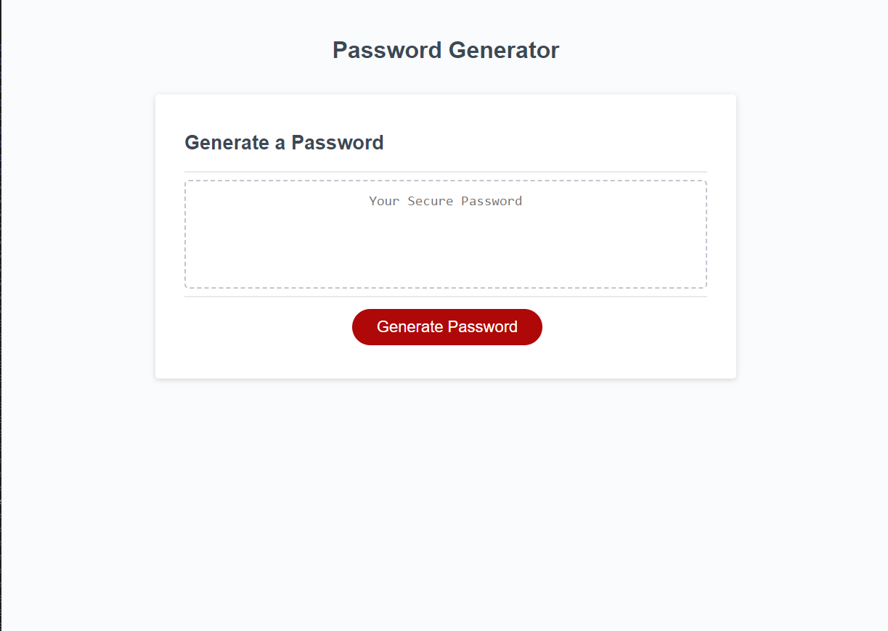

# Password-Generator
## Description 
The motivation behind creating this webpage is the create a random password generator based off of a specific criteria that the user is able to select using JavaScript.  I built this project to use and practice the knowledge and skills that I've learned to create a webpage application that is able to perform a function given a specific criteria. I learned how to properly present variables and how to organize them into a function using logic and conditional statements.  This has furthered my knowledge and practice in JavaScript and has helped me become more familiar with the proper vocabulary to use and the thought process and execution when it comes to writing a code in JavaScript.

## Usage
A visual as to how to page should appear:

## Credits
Referenced resources: 
https://developer.mozilla.org/en-US/ 
 
https://www.w3schools.com/

## Code Source
https://github.com/ellacheu/Password-Generator
 
https://ellacheu.github.io/Password-Generator/

## License 
MIT License

Copyright (c) 2023 elayne

Permission is hereby granted, free of charge, to any person obtaining a copy of this software and associated documentation files (the "Software"), to deal in the Software without restriction, including without limitation the rights to use, copy, modify, merge, publish, distribute, sublicense, and/or sell copies of the Software, and to permit persons to whom the Software is furnished to do so, subject to the following conditions:

The above copyright notice and this permission notice shall be included in all copies or substantial portions of the Software.

THE SOFTWARE IS PROVIDED "AS IS", WITHOUT WARRANTY OF ANY KIND, EXPRESS OR IMPLIED, INCLUDING BUT NOT LIMITED TO THE WARRANTIES OF MERCHANTABILITY, FITNESS FOR A PARTICULAR PURPOSE AND NONINFRINGEMENT. IN NO EVENT SHALL THE AUTHORS OR COPYRIGHT HOLDERS BE LIABLE FOR ANY CLAIM, DAMAGES OR OTHER LIABILITY, WHETHER IN AN ACTION OF CONTRACT, TORT OR OTHERWISE, ARISING FROM, OUT OF OR IN CONNECTION WITH THE SOFTWARE OR THE USE OR OTHER DEALINGS IN THE SOFTWARE.
